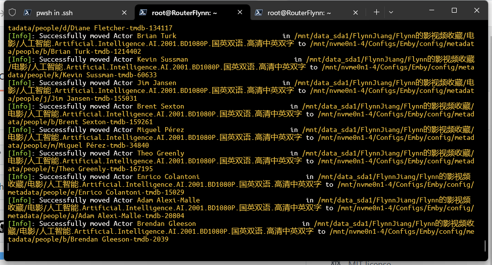
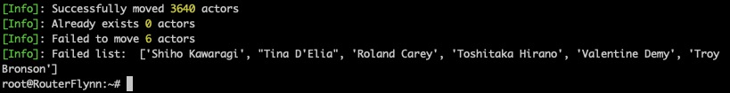

## Jellyfin2EmbyTool

Emby和Jellyfin是两款常用的私有媒体库软件，它们能够在配置调整后正常展示所有影片。但是，这两个平台在展示影片页面的演员头像处理上存在差异。本工具旨在解决这一问题：它能将演员照片从Jellyfin的存储位置复制到Emby能够识别的位置。这样，无论是在哪一款媒体库中，演员的头像都能被正常显示。

## 使用方式

- 安装所需库
```
pip install requests
pip install PyYAML
```

- 填写配置脚本，设置转换路径

在`config.yaml`中，有以下配置项

```yaml
tmdb-api:
  API-key: 

path:
  source: 
  target: 

proxy: 
  http: 
  https: 

sleep: 
```

API-key填写在tmdb官网注册后提供的API key, 被设置为必填项。

path中的source是电影原文件所在的上级目录的上级目录，也即`/some_other_path/movie/movie_name/.actor`中对应的movie级目录，而target对应emby媒体库的演员存储位置`Emby/config/metadata/people`，这两个选项也被设置为必填项。

脚本会自动创建`people`下的按首字母分类的子文件夹，并将原本`.actors`内的所有图片分类按照emby的格式放入其中，tmdb编号则通过api获取。

而proxy中http和https，则是代理选项，api接口是国内原生网络环境无法访问的，请根据自己的需求填写，可以留空。

sleep是每次请求tmdb-api接口的间隔时间，不填或填0都是不等待。

- 运行脚本

```sh
python3 script.py
```

## 效果展示



